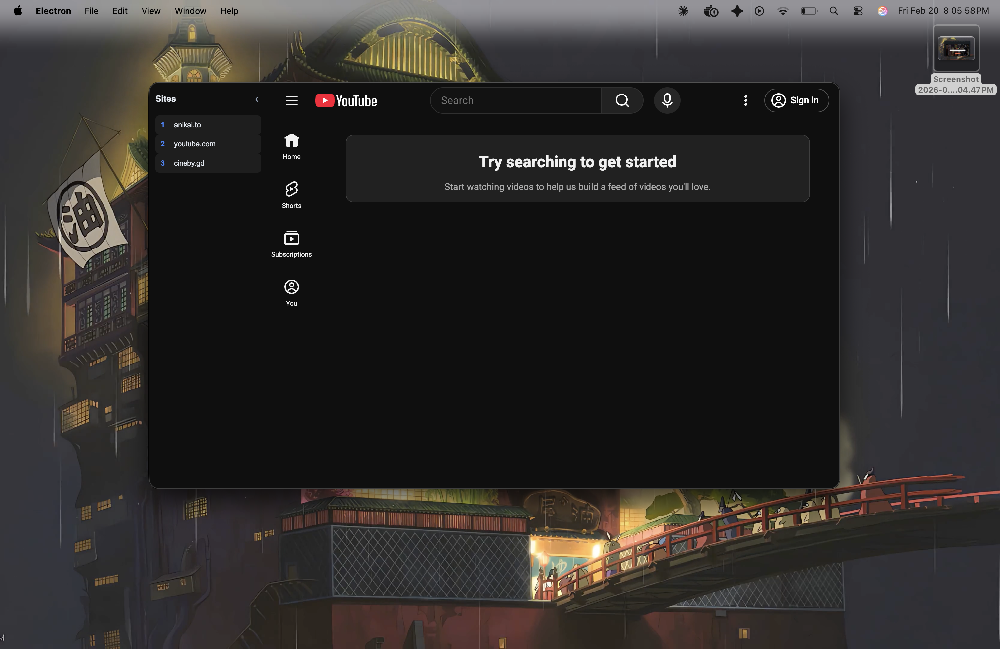

<div align="center">

# headless-browser

**A minimal, frameless Electron browser with site group management.**

Launch curated sets of websites from the command line, switch between them with a collapsible sidebar, and keep your workspace distraction-free. Or launch it standalone as a clean, minimal browser.

[](https://www.electronjs.org/)
[](https://www.python.org/)
[](LICENSE)

</div>

---

<div align="center">

<!-- Replace the line below with your screenshot -->



</div>

---

## Features

- **Bare mode** -- launch without a group to get a clean browser pointed at Google, no sidebar
- **Search bar popup** -- press `Cmd/Ctrl+L` to open a search overlay; type a URL or search query and hit Enter
- **Frameless window** -- clean, borderless chrome with a transparent drag region
- **Collapsible sidebar** -- quick-switch between sites; collapse to a slim 40px strip
- **Site groups** -- save named collections of URLs that persist across sessions
- **CLI management** -- create, edit, delete, and view groups from your terminal
- **Dark theme** -- easy on the eyes with a `#0f0f0f` background
- **Fullscreen-in-window** -- webview fullscreen expands within the app window, not your entire display
- **Keyboard shortcuts** -- `Cmd/Ctrl+R` reload, `Cmd/Ctrl+←` back, `Cmd/Ctrl+→` forward, `Cmd/Ctrl+L` search bar
- **Keyboard-number nav** -- sites are numbered for fast identification

## Quick Start

```bash
# clone & install
git clone https://github.com/whitemask-1/headless-browser.git
cd headless-browser
npm install

# launch as a standalone browser (bare mode)
npm start

# or create a site group and launch it
python src/manage.py
npm start -- <group-name>
```

## Usage

### Bare Mode (No Group)

```bash
npm start
```

Opens a frameless window pointed straight at Google with no sidebar. Use `Cmd/Ctrl+L` to open the search bar, type a URL or search term, and press Enter.

### Managing Groups

Run the interactive CLI to create and organize your site groups:

```bash
python src/manage.py
```

```
Groups: none
1) Create/edit group  2) Delete group  3) View group  q) Quit
> 1
Group name: work
Enter URLs one per line, empty line to finish:
  1: https://github.com
  2: https://linear.app
  3: https://notion.so
  4:
Saved group 'work'
```

Groups are stored in `~/.browser_groups.json`.

### Launching a Group

```bash
npm start -- work
```

This opens a frameless window with your sites listed in the sidebar. Click any site to load it in the main webview. Hit the toggle button (`‹`) to collapse the sidebar.

### Search Bar

Press **`Cmd+L`** (macOS) or **`Ctrl+L`** (Windows/Linux) at any time to open the search overlay.

- Type a **URL** (e.g. `github.com`) → navigates directly
- Type a **search query** (e.g. `electron docs`) → searches Google
- Press **Enter** to go, **Escape** to dismiss

## Keyboard Shortcuts

| Shortcut | Action |
| --- | --- |
| `Cmd/Ctrl + L` | Open search bar |
| `Cmd/Ctrl + R` | Reload current page |
| `Cmd/Ctrl + ←` | Go back |
| `Cmd/Ctrl + →` | Go forward |
| `Escape` | Close search bar |

## Project Structure

```
headless-browser/
├── main.js          # Electron main process -- window creation, site injection
├── index.html       # UI shell -- sidebar, webview, search overlay, inline styles
├── renderer.js      # Renderer -- sidebar buttons, navigation, search, collapse toggle
├── src/
│   └── manage.py    # Python CLI for CRUD on site groups
├── package.json
└── README.md
```

## How It Works

| Component     | Role                                                                                                                            |
| ------------- | ------------------------------------------------------------------------------------------------------------------------------- |
| `main.js`     | Reads `~/.browser_groups.json`, creates a frameless `BrowserWindow`, injects site data, handles in-window fullscreen and keyboard shortcuts |
| `index.html`  | Defines the layout: a fixed transparent drag region, collapsible sidebar, search overlay, and a `<webview>` for browsing        |
| `renderer.js` | Waits for injected site data, dynamically creates sidebar buttons, handles navigation, search bar, and collapse. In bare mode, hides the sidebar and loads Google |
| `manage.py`   | Interactive CLI that reads/writes `~/.browser_groups.json` for group management                                                 |

## Requirements

| Dependency | Version |
| ---------- | ------- |
| Node.js    | 18+     |
| Python     | 3.8+    |
| Electron   | 40.6    |

## Contributing

1. Fork the repo
2. Create a feature branch (`git checkout -b feature/my-feature`)
3. Commit your changes
4. Push to the branch and open a PR

## License

ISC
